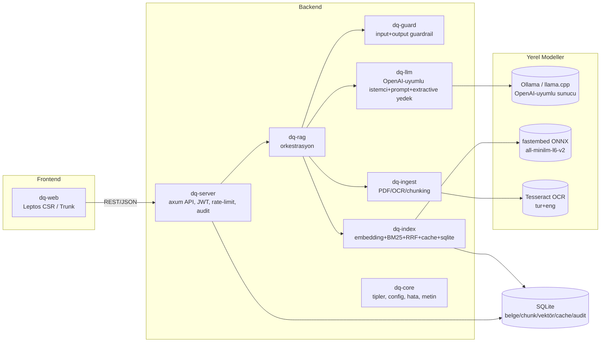

# Belge Analiz ve Soru-Cevap Sistemi (doc-qa-system)

Yüklenen PDF/görüntü belgeleri üzerinde, tamamen **yerel** (air-gapped
çalışabilen) modellerle doğal dilde soru-cevap yapan; halüsinasyonu
guardrail'lerle sınırlayan; gizlilik dereceli (TASNİF DIŞI → ÇOK GİZLİ)
erişim kontrolü ve değiştirilemez denetim kaydı (audit log) uygulayan bir
Belge Analiz ve Soru-Cevap Sistemi. Rust ile, savunma sanayii kullanımı göz
önünde bulundurularak geliştirilmiştir.

Geliştirme sürecinin ayrıntıları için [DEVLOG.md](DEVLOG.md), test senaryoları
ve sonuçları için [TESTING.md](TESTING.md) dosyalarına bakın.

## 1. Mimari



**Katmanlar** (her biri ayrı bir Cargo crate'i, bağımsız test edilebilir):

| Crate | Sorumluluk |
|---|---|
| `dq-core` | Ortak tipler (`Classification`, `Document`, `Answer`...), config, hata modeli, Türkçe'ye duyarlı metin araçları |
| `dq-ingest` | PDF metin/görüntü çıkarımı (`pdf-extract` + `lopdf`), OCR (Tesseract), yapıya duyarlı chunking |
| `dq-index` | Embedding (fastembed/ONNX), SQLite depolama, BM25 + dense hibrit arama (RRF), MMR çeşitlendirme, çok katmanlı cevap önbelleği |
| `dq-guard` | Girdi guardrail (prompt injection, PII), çıktı guardrail (groundedness/kaynak doğrulama, PII maskeleme, gizlilik damgalama) |
| `dq-llm` | OpenAI-uyumlu yerel LLM istemcisi, prompt şablonları, LLM'siz alıntı-tabanlı (extractive) yedek, zayıf model çıktısından JSON çıkarma (`dq-llm::json`) |
| `dq-rag` | Uçtan uca orkestrasyon; **agentik RAG döngüsü** (planlama/sorgu ayırıştırma → çoklu alt-sorgu hibrit arama → üretim → groundedness eleştirisi → gerekirse self-correction, `agent.max_steps` tavu ile) |
| `dq-server` | axum HTTP API, JWT + Argon2 kimlik doğrulama, hız sınırlama, CORS, hash-zincirli denetim kaydı |
| `dq-web` | Leptos (Rust→WASM) tek sayfa arayüzü: giriş, belge yükleme/listeleme, soru-cevap, denetim kaydı |

## 2. Neden bu teknik kararlar?

- **Tamamen yerel model kullanımı**: LLM için OpenAI-uyumlu `/v1/chat/completions`
  arayüzü konuşan **herhangi bir** yerel sunucu (Ollama, llama.cpp server, vLLM)
  desteklenir — bulut API çağrısı yoktur. Savunma sanayii için ağ izolasyonu
  (air-gap) zorunluluğu bunu gerektiriyor.
- **Hibrit arama (dense + BM25) + RRF + MMR**: Yalnızca embedding, "MADDE 7"
  gibi tam eşleşme gerektiren teknik/hukuki ifadelerde başarısız olur; BM25 bu
  boşluğu kapatır. Reciprocal Rank Fusion skorları normalize etmeye çalışmak
  yerine sıralamayı birleştirir (daha kararlı). MMR, aynı paragrafın komşu
  parçalarının bağlamı doldurup farklı kaynakları dışlamasını engeller.
- **Guardrail'ler kural-tabanlı ve açıklanabilir**: Ek bir sınıflandırıcı model
  yerine regex kuralları kullanıldı; her tetiklenen kural adı ve ağırlığıyla
  denetim kaydına yazılır. Kapalı ağda ek model = ek gecikme + ek belirsizlik.
- **Groundedness (kaynak doğrulama) modelsiz çalışır**: Cevaptaki her cümle,
  atıf verdiği kaynak parçayla karakter n-gram *containment* oranı üzerinden
  doğrulanır. Yetersiz destek → cevap otomatik reddedilir ("Bu bilgi belgelerde
  bulunmuyor"). Bu, "sistemin belgede olmayan bilgi üretmemesi" gereksinimini
  doğrudan karşılar.
- **Gizlilik dereceli erişim (Bell-LaPadula "no read up")**: Belgeler
  TASNİF DIŞI/HİZMETE ÖZEL/ÖZEL/GİZLİ/ÇOK GİZLİ olarak etiketlenir; arama
  *sırasında* kullanıcının yetkisinin üzerindeki belgeler aday listesine hiç
  girmez (sonradan filtrelenmez — bilgi sızıntısı riskine karşı).
- **SQLite tek dosya depolama**: Kapalı ağ / tek makine kurulumunda harici bir
  vektör veritabanı (Qdrant, pgvector) işletmek operasyonel yük getirir; vektörler
  aynı dosyada BLOB olarak tutulur, yedekleme tek dosya kopyalamaya iner.
  Chunk hacmi (10⁴–10⁵ mertebesi) için tam (exact) kosinüs taraması ANN'e
  (HNSW) göre yeterince hızlı ve daha basittir; `VectorIndex` trait'i arkasında
  gizlendiği için ileride HNSW'e geçmek mimari değişiklik gerektirmez.
- **Hash-zincirli denetim kaydı**: Her audit satırı, bir önceki satırın SHA-256
  hash'ini içerir; `GET /api/audit/verify` zincirin bütünlüğünü doğrular ve
  kurcalanan ilk kaydı raporlar.
- **Leptos + Trunk (Rust→WASM)**: Frontend de dahil tüm yığın Rust; JavaScript
  bağımlılığı yoktur.

## 3. Kurulum

### 3.1 Gereksinimler

- Rust (stable, `rustup` ile) — Windows'ta ayrıca **MSVC Build Tools + Windows
  10/11 SDK** gerekir (`link.exe`, `kernel32.lib` için).
- [Trunk](https://trunk-rs.github.io/trunk/) — `cargo install trunk` — ve
  `wasm32-unknown-unknown` hedefi — `rustup target add wasm32-unknown-unknown`.
- **Tesseract OCR** (taranmış belgeler ve resim yüklemeleri için), `tur` ve
  `eng` dil paketleriyle. Kurulu değilse sistem OCR gerektirmeyen (metin
  katmanlı) PDF'lerle çalışmaya devam eder; taranmış sayfalar/resimler
  atlanır ve kullanıcıya uyarı olarak bildirilir.
- Yerel bir LLM sunucusu: **Ollama** (`ollama serve`, varsayılan
  `http://127.0.0.1:11434/v1`) veya llama.cpp `server` (OpenAI-uyumlu mod).
  LLM erişilemezse sistem otomatik olarak **alıntı-tabanlı (extractive)**
  yedek moda düşer (halüsinasyon riski sıfır, akıcılık daha düşük).

### 3.2 Backend

```powershell
# JWT imzalama anahtarı (>=32 karakter) - üretimde ortam degiskeninden verilmeli
$env:DQ_JWT_SECRET = "en-az-32-karakterlik-gizli-bir-anahtar-buraya"

cargo run -p dq-server
# varsayılan: http://127.0.0.1:8080, ayarlar: config/default.toml
```

İlk açılışta `config/default.toml` içindeki `[[auth.users]]` tohum
kullanıcıları (varsayılan: `analist` / `admin`, parola `degistir-beni`)
Argon2 ile hash'lenip veritabanına yazılır. **Üretimde bu parolaları ve
`DQ_JWT_SECRET`'i mutlaka değiştirin.**

### 3.3 Frontend (geliştirme modu)

```powershell
cd crates/dq-web
trunk serve
# http://127.0.0.1:8081 - /api istekleri Trunk.toml proxy ile backend'e (8080) yönlendirilir
```

Üretim derlemesi: `trunk build --release` → `crates/dq-web/dist/` klasörünü
backend ile aynı origin'den (ör. bir ters vekil/nginx ile) servis edin.

### 3.4 Konfigürasyon

Tüm ayarlar `config/default.toml`'da; önemli `DQ_*` ortam değişkeni
geçersiz kılmaları: `DQ_SERVER_PORT`, `DQ_LLM_BASE_URL`, `DQ_LLM_MODEL`,
`DQ_LLM_API_KEY`, `DQ_JWT_SECRET`, `DQ_DB_PATH`, `DQ_MODEL_DIR`,
`DQ_OCR_ENGINE`, `DQ_EMBEDDING_OFFLINE`, `DQ_AUTH_ENABLED`.

Air-gapped (tamamen kapalı ağ) kurulum için `embedding.offline = true`
yapın ve `models/embeddings` dizinini önceden doldurun.

## 4. API özeti

| Uç nokta | Açıklama |
|---|---|
| `GET /api/live` | Canlılık (liveness) yoklaması — Docker/K8s HEALTHCHECK |
| `GET /api/health` | Servis durumu, OCR motoru, embedding/LLM modeli, önbellek istatistikleri |
| `GET /metrics` | Prometheus metrikleri (istek sayacı, gecikme, `dq_ask_*`, `dq_ingest_*`) |
| `POST /api/auth/login` | `{username, password}` → JWT |
| `POST /api/documents` | Multipart: `file`, `classification` — belge yükle |
| `GET /api/documents` | Kullanıcının yetkisindeki belgeleri listele |
| `DELETE /api/documents/{id}` | Belgeyi sil (yalnızca `admin` rolü) |
| `POST /api/ask` | `{query, doc_ids?}` → `Answer` (kaynaklar, groundedness, ajan izi `trace`, uyarılar) |
| `GET /api/audit` | Denetim kaydı (yalnızca `admin`) |
| `GET /api/audit/verify` | Denetim zinciri bütünlük kontrolü |

## 5. Test

```powershell
cargo test --workspace --exclude dq-web
```

67 birim/entegrasyon testi backend'in tamamını kapsar (metin normalizasyonu,
chunking, BM25, hibrit füzyon, guardrail'ler, JWT, audit zinciri doğrulama,
agentic RAG döngüsü — LLM yokken extractive yedeğe düşüş ve self-correction
yeniden denemesi — ve JSON çıkarma katmanı). Ayrıntılar için
[TESTING.md](TESTING.md).

## 6. Bilinen sınırlamalar

- Cross-encoder yeniden sıralama (`embedding.reranker_model`) opsiyoneldir;
  boş bırakılırsa RRF + normalize skorların ağırlıklı birleşimi kullanılır.
- OCR kalitesi Tesseract'ın kurulu dil paketlerine bağlıdır; düşük çözünürlüklü
  taramalarda güven skoru düşer ve kullanıcıya açıkça bildirilir.
- Dense vektör indeksi bellek içi tam taramadır; çok büyük korpuslarda (>10⁶
  chunk) ANN indeksine geçiş gerekebilir (mimari buna izin verir).
